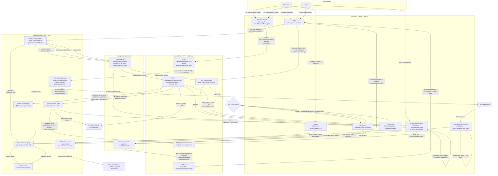

```mermaid
flowchart TD

%% === AKTORZY ===
subgraph U["Użytkownicy"]
  UOwner["Właściciel"]
  UTenant["Lokator"]
end

%% === WARSTWA UI (Astro + React) ===
subgraph UI["Warstwa UI (Astro + React)"]
  LPage["/login\nAuthLayout + LoginForm"]
  ROwnerPage["/register\nAuthLayout + RegisterOwnerForm"]
  RTenantPage["/register/tenant?token\nAuthLayout + TenantRegisterForm\n(+ info o mieszkaniu)"]
  ResetReqPage["/reset-password\nAuthLayout + ForgotPasswordForm (plan)"]
  ResetConfPage["/reset-password/confirm\nAuthLayout + ResetPasswordForm (plan)"]
  OnboardingPage["/onboarding\nOnboardingLayout + OnboardingWizard"]
  DashboardPage["/dashboard\nDashboard (owner/tenant)"]
end

%% === BACKEND ASTRO (API + middleware) ===
subgraph BE["Backend Astro (API + middleware)"]
  MW["middleware\n(read JWT → locals.user,locals.supabase)"]
  MeAPI["GET /api/users/me\nprofil + rola ('owner'|'tenant')"]
  InvGetAPI["GET /api/invitations/:token\nwalidacja linku zaproszenia"]
  InvAcceptAPI["POST /api/invitations/:token/accept\npowiązanie lokatora z mieszkaniem"]
  ResetReqAPI["POST /api/auth/password/reset-request\ninicjacja resetu hasła (plan)"]
end

%% === SUPABASE (Auth + DB) ===
subgraph SB["Supabase (Auth + DB + RLS)"]
  AuthSignup["POST /auth/v1/signup\n(rejestracja owner/tenant)"]
  AuthToken["POST /auth/v1/token?grant_type=password\n(logowanie e-mail+hasło)"]
  AuthRecover["POST /auth/v1/recover\nresetPasswordForEmail\n(redirectTo /reset-password/confirm)"]
  AuthUpdate["PUT /auth/v1/user\n{ password }\nustawienie nowego hasła"]
  UsersTable["Tabela users\n(role: 'owner' | 'tenant')"]
  InvLinks["Tabela invitation_links\nlinki zaproszeń + status"]
  Leases["Tabele najmów/opłat\n(RLS wg roli i powiązań)"]
end

%% === POMOCNICZE ===
subgraph CL["Storage tokenów (front)"]
  SaveTokens["Zapis tokenów\nlocalStorage + cookies\n(rentflow_auth_token, rentflow_refresh_token)"]
  ClearTokens["Usunięcie tokenów\nlogout() w src/lib/utils/auth.ts"]
end

%% --- LOGOWANIE (US-003) ---
UOwner -->|"Podaje e-mail+hasło"| LPage
UTenant -->|"Podaje e-mail+hasło"| LPage
LPage -->|"fetch /auth/v1/token?grant_type=password"| AuthToken
AuthToken -->|"access_token (+refresh_token)"| SaveTokens
SaveTokens -->|"Authorization: Bearer <JWT>"| MeAPI
MeAPI -->|"profil + rola"| DashboardDecision

%% decyzja po zalogowaniu
DashboardDecision{"Rola + stan danych"}
DashboardDecision -->|"owner + brak mieszkań"| OnboardingPage
DashboardDecision -->|"owner + ma mieszkania"| DashboardPage
DashboardDecision -->|"tenant"| DashboardPage

%% --- REJESTRACJA WŁAŚCICIELA (US-001 + US-AUTH-001) ---
UOwner -->|"Wypełnia formularz rejestracji"| ROwnerPage
ROwnerPage -->|"POST /auth/v1/signup\nrole='owner'"| AuthSignup
AuthSignup -->|"SUKCES\n(docelowo) login"| AuthToken
AuthSignup -->|"Tworzy rekord"| UsersTable
AuthToken -->|"docelowo: zapis tokenów"| SaveTokens
SaveTokens -->|"po rejestracji właściciela"| OnboardingPage

%% --- REJESTRACJA LOKATORA Z LINKU (US-002, US-043, US-050, US-053) ---
UTenant -->|"Klik link zaproszenia"| RTenantPage
RTenantPage -->|"SSR: GET /api/invitations/:token"| InvGetAPI
InvGetAPI -->|"sprawdza token\n(invitation_links, RLS omijane\nprzez service role)"| InvLinks
InvLinks -->|"OK\n(apartment + owner info)"| RTenantPage
InvLinks -->|"Błąd/zużyty token\n→ 400"| InvitationExpired["/invitation-expired\n(UX komunikat)"]
RTenantPage -->|"Wyświetla nazwę+adres mieszkania, właściciela"| RTenantPage

%% submit formularza lokatora
RTenantPage -->|"Supabase signup tenant"| AuthSignup
AuthSignup -->|"user{role:'tenant'}"| UsersTable
AuthSignup -->|"następnie login"| AuthToken
AuthToken -->|"access_token"| SaveTokens

%% akceptacja zaproszenia
SaveTokens -->|"Authorization: Bearer <JWT>"| InvAcceptAPI
InvAcceptAPI -->|"service role Supabase\nvalidate + accept"| InvLinks
InvAcceptAPI -->|"sprawdza ograniczenia\n(USER_HAS_LEASE,\nAPARTMENT_HAS_LEASE)"| Leases
InvAcceptAPI -->|"SUKCES"| DashboardPage
InvAcceptAPI -->|"INVALID_TOKEN\n→ 400"| InvitationExpired
InvAcceptAPI -->|"USER_HAS_LEASE\n→ 400\nkomunikat biznesowy"| RTenantPage

%% --- RESET HASŁA (US-005, US-006 – plan z auth-spec) ---
UOwner -->|"Link 'Nie pamiętasz hasła?'"| ResetReqPage
UTenant -->|"Link 'Nie pamiętasz hasła?'"| ResetReqPage
ResetReqPage -->|"POST /api/auth/password/reset-request\nz e-mailem"| ResetReqAPI
ResetReqAPI -->|"auth.resetPasswordForEmail(...) via service role"| AuthRecover
AuthRecover -->|"E-mail z linkiem\nredirectTo /reset-password/confirm"| UserEmail["Skrzynka e-mail"]

UserEmail -->|"Klik link resetu"| ResetConfPage
ResetConfPage -->|"czyta access_token z URL hash"| ResetConfPage
ResetConfPage -->|"PUT /auth/v1/user { password }"| AuthUpdate
AuthUpdate -->|"Nowe hasło ustawione"| ResetDone["Komunikat sukcesu\n→ redirect /login lub /dashboard"]

%% --- ONBOARDING (US-010, US-AUTH-005) ---
OnboardingPage -->|"<script> sprawdza rentflow_auth_token\n+ GET /api/users/me"| MeAPI
MeAPI -->|"brak usera/rola≠owner\n→ redirect /login?redirect=/onboarding"| LPage

%% --- WYLOGOWANIE (US-004) ---
DashboardPage -->|"Klik 'Wyloguj'"| ClearTokens
ClearTokens -->|"czyści localStorage + cookies\nwindow.location='/login'"| LPage
ClearTokens -->|"brak tokenu przy kolejnych żądaniach\nmiddleware ustawia locals.user=null"| MW
MW -->|"protected pages/API\nzwracają 401 / redirect /login"| LPage
```

